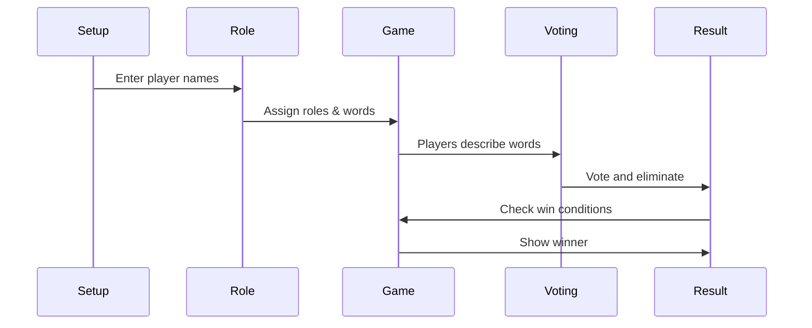

# Undercover Game Documentation

## 📜 Overview
This is a Flutter implementation of the popular social deduction game "Undercover" where players try to identify who among them is the "Undercover" player based on word clues.

## 🎮 Game Rules
- **Players**: 3-12 players
- **Roles**:
  - **Citizens**: Get one word (e.g., "Cat")
  - **Undercover**: Gets a similar but different word (e.g., "Tiger")
- **Gameplay**:
  1. Players take turns describing their word without saying it directly
  2. After all speak, players vote on who they think is the Undercover
  3. Player with most votes is eliminated
- **Winning**:
  - Citizens win if Undercover is voted out
  - Undercover wins if only 2 players remain

## 🛠️ How to Run the Game

### Prerequisites
- Flutter SDK installed (version 3.0+)
- Dart SDK (version 2.17+)
- IDE (Android Studio/VSCode recommended)

### Installation Steps
1. **Clone the repository**:
   ```bash
   git clone [https://github.com/jankoabel/undercover_game-task]
   cd undercover_game
   ```

2. **Install dependencies**:
   ```bash
   flutter pub get
   ```

3. **Run the app**:
   ```bash
   flutter run
   ```

### Running on Different Platforms
- **Web**: `flutter run -d chrome`
- **Android**: `flutter run -d android`
- **iOS**: `flutter run -d ios`

## 🧠 Game Logic Explained

### 1. Player Setup
- Users enter player names (3-12 players)
- Names can be entered individually or pasted as comma-separated values
- Game starts when all names are entered

### 2. Role Assignment
- One random player becomes the Undercover
- All others are Citizens
- Each player sees:
  - Their role (secretly)
  - Their secret word

### 3. Game Flow


### 4. Voting System
- Each player gets one vote per round
- Player with most votes is eliminated
- If tie: No one is eliminated
- Game continues until win condition is met

### 5. Win Conditions
- **Citizens win** when:
  - Undercover is voted out
- **Undercover wins** when:
  - Only 2 players remain (including Undercover)

## 📂 Code Structure
```
lib/
├── main.dart          # App entry point
├── core/              # Game logic and data
│   ├── models/        # Data structures
│   ├── providers/     # State management
│   └── constants/     # Game settings
├── features/          # UI screens
│   ├── player_setup/  # Name entry
│   ├── role_assignment/ # Role reveal
│   ├── game_play/     # Main game screen
│   └── game_over/     # Victory screen
└── shared/            # Reusable components
```

## 🔄 State Management
- Uses **Provider** package to manage game state
- Key states tracked:
  - Player list with roles
  - Current round
  - Voting results
  - Game phase (setup, playing, voting, game over)

## 🎨 UI Components
- **Animated transitions** between screens
- **Role reveal** with dramatic animations
- **Voting interface** with simple tap-to-vote
- **Victory screen** with winner announcement

## 💡 Tips for Modifying
1. **To add new word pairs**:
   - Edit `word_pairs.dart` in core/constants
   - Add new WordPair("Word1", "Word2")

2. **To change player count**:
   - Modify `game_constants.dart`
   - Update minPlayers and maxPlayers values

3. **To change UI theme**:
   - Edit colors in `app_colors.dart`
   - Update styles in `app_styles.dart`

## 🚀 Deployment
To build for production:
```bash
flutter build web  # For web deployment
flutter build apk  # For Android
flutter build ios  # For iOS
```

## ❓ Common Issues
1. **Fonts not loading**:
   - Ensure font files are in `assets/fonts/`
   - Check pubspec.yaml font declarations

2. **Provider errors**:
   - Make sure Provider is in pubspec.yaml
   - Run `flutter pub get`

3. **Game not starting**:
   - Verify all player names are entered
   - Check for at least 3 players
